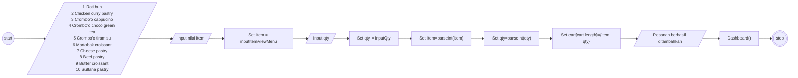
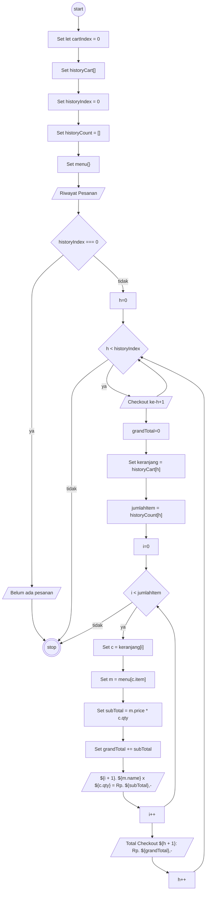
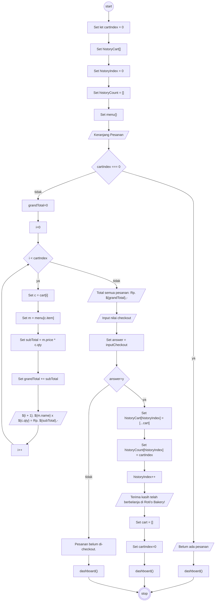
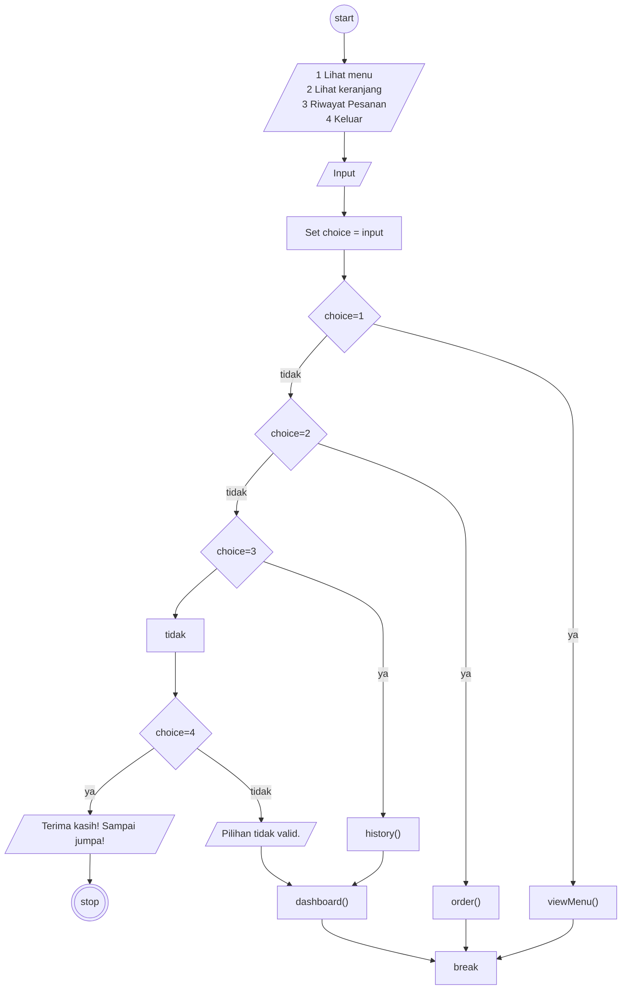
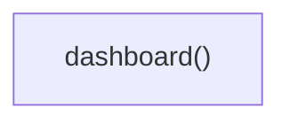

# Flowchart Roti'o

### Fungsi viewMenu

<!-- let cart = [];
let cartIndex = 0;
let historyCart = [];
let historyIndex = 0;
let historyCount = []; -->

### Fungsi history

### Fungsi order

### Fungsi dashboard

### Run Function

